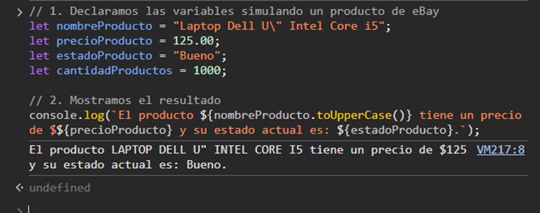
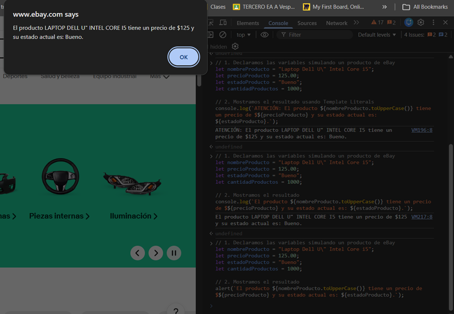
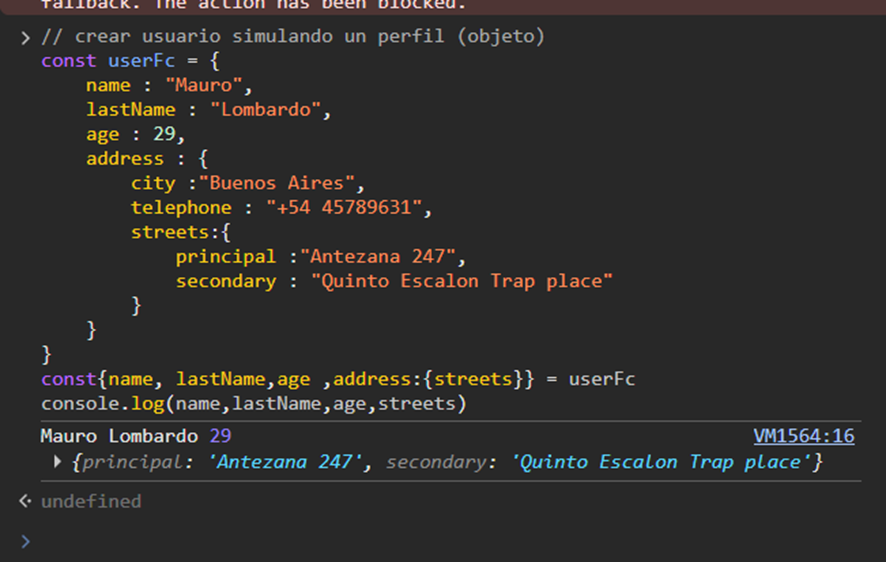
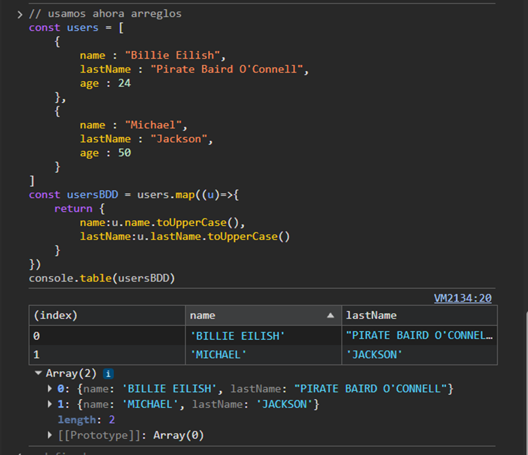

# 🌐 Desarrollo de Aplicaciones Web: Laboratorio de JS

> **Institución:** Escuela Politécnica Nacional (EPN)  
> **Unidad:** Introducción a JavaScript (Laboratorio 04 & 05)  
> **Plataforma de Pruebas:** Replit / Console Log

---

## 🚀 Resumen del Proyecto
Este repositorio contiene la implementación práctica de lógica programática en el lenguaje **JavaScript (ES6+)**, enfocada en el manejo de datos dinámicos y estructuras de objetos para aplicaciones web.

### 🧪 Competencias Desarrolladas
* **Sintaxis de Variables:** Implementación de variables de bloque (`let`) y manipulación de cadenas con *Template Literals*.
* **Modelado JSON:** Creación de objetos complejos con múltiples niveles de anidamiento para representar perfiles de usuario.
* **Técnicas de Desestructuración:** Extracción eficiente de datos desde estructuras jerárquicas (objetos y sub-objetos).
* **Gestión de Arreglos:** Uso de métodos funcionales como `.map()` para la transformación de bases de datos de usuarios.

---

## 🛠️ Ejemplos de Implementación

### 🔹 Gestión de Entidades (Objetos)
Se modeló un objeto `userFc` que simula la estructura de una red social, organizando datos de contacto y ubicación mediante objetos anidados. Se aplicó desestructuración para acceder a las propiedades de dirección (`streets`) de forma directa.

### 🔹 Transformación de Datos (Arrays)
Se implementó un sistema de mapeo para normalizar registros de usuarios. Mediante el uso de funciones flecha y el método `.map()`, se transformaron colecciones de objetos a un formato estandarizado (mayúsculas), facilitando la lectura de datos mediante `console.table()`.

---

## 📋 Requisitos del Entorno
* Navegador Web moderno (Chrome/Firefox) para visualización de consola.
* Cuenta en GitHub para el control de versiones.
* Editor de código (VS Code o Replit).

---

creamos un objeto principal en este caso laptop en la consola de la pagina de ebay

con alert

simulamos un perfil en facebook como objeto

usamos un arreglo y para mostrarlo usamos la funcion table para poder ver los objetos agregados

## 👤 Equipo de Desarrollo
* **Jairo Maigua** - *Desarrollo de Software*
* **Diego Camacho** - *Desarrollo de Software*
* **Anthony Ledesma** - *Desarrollo de Software*

---
**Tutor:** Ing. Byron Loarte  
**Facultad:** Escuela de Formación de Tecnólogos (ESFOT)  
*© 2026 EPN - Quito, Ecuador*
